# 北京大学肖臻老师《区块链技术与应用》公开课

_视频发布时间：2018 年 11 月 30 日_

## 一丶 BTC(比特币)部分

### 02-BTC-密码学原理

##### 比特币中用到的两个密码学功能：hash(算法) 和 签名（token）

##### 比特币使用的 hash 算法： SHA-256

其中 SHA 是 Secure Hash Algorithm 的缩写,SHA-256 算法同时满足了这三个要素：

- collision resistance（抗碰撞性,是指不同的输入，输出同一个 hash 值的概率）
- hiding
- puzzle friendly

### 03-BTC-数据结构

##### 比特币中使用到的数据结构：哈希链表 和 Merkle Tree

**Merkle Tree 示意图：**


##### 重要概念：

- hash pointers：哈希指针
- 区块链：一个一个的区块组成的链表。
- 在区块链中，每个区块中存储了一个 hash 指针和对应的内容，每一个区块中的 hash 指针是由前一个区块的 hash 指针和内容进行 hash 值运算后得到的。这样做的好处是：本地只需要保存最后一个 hash 值，就可以验证前面的区块内容是否被改动过。

##### 区块链与普通链表的区别：

1. 使用 hash 指针代替了普通的指针。

### 04-BTC-比特币的共识协议

##### 1.数字货币需要解决 double spending attack 问题

- 因为数字货币本质上是个文件，是可以复制的。解决 double spending attack 问题，就是要让数字货币像现金一样，一个面值的纸币，一个人只能使用一次。
- 可以使用区块链解决 double spending attack 问题。
  **比特币交易图：**
  
  从图中可以看出，每个区块中记录了交易信息、交易人的签名（公钥）和交易比特币的来源。其中交易来源的记录解决了 double spending attack 的问题。其中除了每个区块指向使用了哈希指针，记录币的来源也是哈希指针。（扩展：要验证币的来源是否可靠，需要这个区块链上所有交易人的公钥）

##### 2.区块链中每个区块所包含的内容


##### 3.distributed consensus(分布式的共识)

1. 区块链可以理解为一个去中心化的账本，这个账本是所有人共同的账本。
2. 可以使用全局的 distributed hash table (分布式的 hash 表)来实现这个共同的账本。

##### 4.比特币的共识协议

###### 1. 工作量证明（Proof of Work, PoW）：

- 比特币网络使用 PoW 机制来确认交易并生成新的区块。矿工需要解决一个复杂的数学难题（哈希计算），找到一个有效的“哈希值”以添加新区块到区块链中。这个过程需要大量的计算资源和时间。
- 矿工通过计算“Nonce”值（一个用于修改区块头哈希的随机数），不断调整直到找到符合目标难度（即符合规定的哈希前导零数量）的哈希值。
- 这个工作量证明机制保证了比特币网络的安全性，避免了伪造和篡改区块链。

###### 2. 最长链原则（Longest Chain Rule）：

- 比特币网络中的节点总是认为最长的有效区块链是正确的。即，链中包含最多工作量的区块链被认为是合法的。
- 当网络中发生分叉时（例如，不同矿工同时挖出一个区块），节点将选择最长的链作为有效链，这样保证了最终只有一条被接受的链。

###### 3. 去中心化和信任最小化（Decentralization and Trust Minimization）：

- 比特币网络中的每个节点都保持一份完整的区块链副本，并共同维护和验证区块链数据。通过 PoW，所有的节点都可以独立验证交易和区块的有效性，而无需信任任何单一实体。
- 去中心化的特点意味着任何人都可以成为矿工、参与验证过程，并且区块链的数据难以被任何个人或实体篡改。

###### 4. 奖励机制和区块奖励（Block Rewards）：

- 矿工通过成功挖矿并加入新区块到区块链后，获得比特币奖励。这是对矿工投入计算资源的回报。
  区块奖励包括两个部分：新发行的比特币（Block Subsidy）（获得铸币权，这是产生新的币的唯一途径） 和交易手续费（Transaction Fees）。
- 比特币刚发行的时候，成功接入区块时（挖矿），可以发行 50 个比特币；随着时间的推移，区块奖励（Block Subsidy） 会逐渐减少，每 21 万个区块进行一次减半，直到最终所有 2100 万个比特币被挖掘完毕。
- BTC 成功接入区块奖励历史变化：
  ‌ 初始阶段 ‌：比特币在 2009 年推出时，每个区块奖励 50 个比特币。
  ‌ 第一次减半 ‌：2012 年 11 月，奖励减少到 25 个比特币。
  ‌ 第二次减半 ‌：2016 年 7 月，奖励减少到 12.5 个比特币。
  ‌ 第三次减半 ‌：2020 年 5 月，奖励减少到 6.25 个比特币。
  ‌ 第四次减半 ： 2024 年 4 月，奖励减少到 3.125 比特币。
- 比特币总量计算公式：如下图
  
- 截止 2025 年，普通人独自挖矿已经不可能，因为挖矿是比算力的，个人的算力占全球所有人算力的比例，决定你挖到矿的概率，比特币是平均每 10 分钟出一个区块（也就是挖到矿，由比特币的创始人实时调整，最终控制在 10 分钟左右，所以比特币的稀缺性是人为造成的）。假如你的算力能占总算力的 1%,那么概率上，平均每出 100 个区块你可能能挖到一个，这个时间就是 1000 分钟，约 16.7 个小时。但是目前来看 2025 年，你个人的算力可能只能占到总算力的 0.000000001%，等你挖到矿的概率可能得几万年甚至十几万年。而且是概率上这么说，实际上挖到矿的概率跟你之前挖了多久没有关系，就像抛硬币一样，并不是说你连续抛出了多次正面，下次出现反面的概率就提高了。还是保持原来的概率。这在比特币的官方名词叫做 progress free,这种方式反而保证了挖矿的公平性。

### 05-BTC-实现


比特币验证交易的合法性: 就是通过图中的 Input Scripts 和 Output Scripts 配对后执行来完成的。注意！不是同一个交易里的输入和输出脚本，而是将这个交易的输入脚本和前一个区块中的输出脚本配对执行，如果输入和输出脚本拼接在一起执行没有出现错误，那么这个交易就是合法的。

### 06-BTC-网络

##### 网络层：p2p Overlay Network （通过点对点的网络进行广播）

##### 比特币网络设计原则：simple,robust,but not efficient(简单、强健，而不是高效)

##### 比特币的协议中对一个区块大小的限制是 1M

### 07-BTC-挖矿难度

##### 挖矿的过程就是找一个 Nonce ,使它的 hash 值小于等于一个目标值。

```
  H(block header nonce) <= target
```

##### 比特币的哈希算法采用的是 SHA-256,Nonce 的取值范围则为：0 ~ 2^256 之间。

在比特币网络中，挖矿难度和目标值（target）是用来控制区块生产速度和网络稳定性的重要参数。挖矿难度（difficulty）是一个动态调整的量，用来确保每个区块的产生时间平均在 10 分钟左右。目标值（target）是一个具体的数值，用来决定有效的区块哈希。

###### 1.目标值（target）:

- 目标值是一个大数，矿工需要找出一个满足条件的区块哈希。目标值越小，挖矿难度越大，找到满足条件的区块的可能性越低。最初的目标值是 2^256
- 目标值是在网络的每个新区块的难度调整时计算出来的。

###### 2.挖矿难度（Difficulty）：

- 挖矿难度是与这个 target 成反比的
- 挖矿难度是通过当前目标值与最初的目标值（target）的比例来计算的。
- 难度的公式如下：
  ​
  其中最初的目标值不变，为 2^256 次方，当前的目标值会一直调整减小，因此 Difffculty 最小是 1。

###### 3.当前目标值调整过程：

1. 计算过去 2016 个区块的实际出块时间（通常为 2016 个区块应生成的时间是 20160 分钟）（大概是两周时间）。
2. 计算实际出块时间与目标时间的比率（actual_time / target_time）。
3. 调整目标值（target），使得下一个 2016 个区块的生成时间仍然符合目标时间。
   ​

### 08-BTC-挖矿

##### 全节点的职责：

​

##### 轻节点的职责：

​

##### 比特币如何保证安全性？

1. **密码学上的保证：** 别人没有你的私钥，没有办法伪造你的签名，所以无法将你账上的钱转走。（这个前提是拥有大多数算力的矿工是好的，是遵守协议的，不会接受哪些没有合法签名的交易）
2. **共识机制：**

##### 挖矿设备的发展

- **第一代：CPU 挖矿。** 最初，比特币是通过普通的个人电脑 CPU 进行挖矿的。由于计算能力较低，这种方法只能用于比特币网络的早期阶段。
- **第二代：GPU 挖矿。** 随着比特币网络的复杂性增加，CPU 挖矿的效率显著下降，矿工开始转向图形处理单元（GPU）进行挖矿。GPU 具有更强的并行处理能力，能够大幅提高挖矿速度。
- **第三代：FPGA 挖矿。** 矿工开始使用现场可编程门阵列（FPGA）设备。这些设备比 GPU 更高效，能耗更低，但价格较贵。
- **第四代：ASIC 芯片挖矿。** 最终，比特币挖矿进入了 ASIC（应用特定集成电路）时代。ASIC 矿机是专为比特币挖矿优化的硬件，性能远超 GPU 和 FPGA，大幅提高了哈希率并降低了能耗。ASIC 矿机成为当前比特币挖矿的主流设备。但是这种芯片一般来说只能挖指定 mining puzzle 的数字货币，挖不了其他类型的数字货币。除非其他类型的数字货币的 mining puzzle 跟比特币一样。

##### 现代矿工的挖矿方式

- **现代矿工的挖矿方式** 一般是多人合作形成一个组织，这个组织的发起人叫做矿主，矿主会有一个矿池，（全球算力比例图是以矿池统计的）组织下的矿工同时在这个矿池下面工作，共同挖矿，如图所示：
  ​

- **矿工如何获取利益：** 比如下一个区块的 nonce 是前面 70 个 0 开头的，矿主提出只要矿工能获取到前面 60 个 0 的 nonce 就算一个 share,当有矿工挖出矿时，按这个提交的 share 进行分配。

- **一些算力统计图：**
  图一: 按国家算力统计
  ​

  图二: 2014 年 6 月 12 日,矿池算力统计(这张图中可以看出，有个叫 GHash.IO 的矿池，算力占到了 51%，这已经超过了 50%，如果这个矿池想做坏事是很容易操纵的，这个在当时引起了一些恐慌。这个事情公布过后，GHash.IO 矿池主动大幅度降低算力，以免动摇大家对比特币的信心)
  ​

  图三: 2018 年,矿池算力统计
  ​

##### 矿池算力占比高的风险

比如像上图 2 中的 Ghash.IO 矿池,如果占全球 51%的算力，可以做哪些坏事？

1. 分叉攻击（double spending，为了让自己人的货币重复使用）。如图所示：
   ​
   如果 A 给 B 转账了，此时后面已经有六个区块接入（比特币协议认为六个区块，即一个小时后算相对比较安全的），假如这时这个矿池开始进行分叉攻击，从 A 给 B 转账的前一个区块开始接入，将 A 的币又转给 A'（自己人），然后沿着这个区块继续往下接入！由于它的算力占 51%，理论上挖到的区块随着时间的推移是会超过上面的这条链的，自己成为最长链，这样上面的这个区块链就作废了。
2. Boycott（针对某个账户的攻击）,比如针对 A 这个账户，怀疑 A 这个账户进行了非法交易，想要将 A 的账户进行封锁。如果有人将 A 转给 B 的交易发布到区块链上。它马上进行分叉，此时没必要等后面这六个区块，上面等六个区块，是为了让 B 账户放心。由于它的算力强，自己成为最长链。这样就达到了针对 A 账户的目的。

**注意，并不是非要占比 50%以上的算力才能做这些坏事，如果他能动员 50%以上的算力也可以。比如他能动员多个矿池帮他做事。**

### 09-BTC-比特币脚本

##### 比特币使用的脚本语言

**说明：** 比特币使用的脚本语言被称为 Bitcoin Script。它是一种简单的栈式语言，用于执行比特币交易中的条件和操作。Bitcoin Script 并非一种通用编程语言，而是为比特币网络设计的专用脚本语言，旨在验证交易的合法性。

**主要特点：**

1. 栈式语言
   Bitcoin Script 使用栈（stack）作为操作的核心机制，数据通过栈进行推送和弹出，操作符通过栈来执行不同的任务。

2. 无循环和条件跳转
   Bitcoin Script 是一个相对简单的语言，它不支持复杂的循环（如 for 或 while），也不支持条件跳转（如 if 语句），这有助于降低脚本执行的复杂性和资源消耗，确保交易验证的高效性。

3. 基于条件的交易
   Bitcoin Script 允许通过使用各种条件来设置交易，例如限制某人必须签名才能完成交易（签名验证），或者要求多个参与者共同签名才能执行交易（多重签名）。

4. 安全性和限制性
   Bitcoin Script 的设计目标是安全、简单和有限制。它并没有完整的编程功能（如图形界面、无限循环等），从而减少了智能合约或交易验证时可能出现的安全漏洞。

##### 比特币相关交易图

**交易实例图说明：**
​

**交易结构（json 格式）：**
​

**交易的输入结构（数组）：**
​

**交易的输出结构（数组）：**
​

##### 比特币交易的脚本方案和相关脚本执行过程看视频中的 PPT，更清晰易懂

### 10-BTC-分叉

在比特币和区块链的术语中，分叉指的是区块链协议的变化，导致网络中的不同节点或参与者采取不同的规则。分叉可以分为两种主要类型：<u>硬分叉（Hard Fork）</u> 和 <u>软分叉（Soft Fork）</u>。

##### 1.硬分叉（Hard Fork）

**定义：** 硬分叉是区块链协议的一种改变，它与之前的版本不兼容。这意味着，硬分叉后，遵循新规则的节点和遵循旧规则的节点将无法互相通信，形成两个独立的区块链。

**特点：**

- 不兼容性：硬分叉改变了协议的核心规则，导致分叉前后版本的区块链不再兼容。
- 永久性分裂：一旦发生硬分叉，分裂通常是永久的，两个区块链会各自独立发展。
- 需要全网共识：硬分叉通常需要大部分矿工和节点的支持才能生效。
- 例子：比特币现金（Bitcoin Cash，BCH）就是从比特币（BTC）硬分叉出来的。

##### 2.软分叉（Soft Fork）

**定义：** 软分叉是区块链协议的一种改变，它与之前的版本是兼容的。即使一些节点没有更新到新规则，它们仍然能够与遵循新规则的节点进行通信。软分叉只会限制某些操作，而不是增加新规则。

**特点：**

- 不兼容性：软分叉改变了协议的规则，但不破坏与旧版本节点的兼容性。
- 可能是临时的：由于软分叉不导致区块链的永久分裂，因此一旦多数参与者遵循新规则，软分叉可以自动结束。
- 不需要全网支持：只要有足够的算力支持新规则，软分叉可以有效实施，尽管不是所有节点都需要升级。
- 例子：比特币的 SegWit（隔离见证）升级就是一次软分叉。

##### 总结：

**硬分叉：** 不兼容、会导致区块链永久分裂。
**软分叉：** 兼容、不会导致永久分裂，但可能需要大多数矿工和节点的支持。

### 11-BTC-问答

##### 问题一：转账交易的时候如果接收者不在线怎么办？

答：没有影响，转账交易时接收者不需要在线。转账交易只不过是需要在区块链上记录一下，把转账者账户上的比特币转到接收者的账户上。

##### 问题二：假设某个全节点收到了一个转账交易，有没有可能转账交易中接收者的收款地址是这个节点以前从来没有听说过的？

答：是有可能的。因为比特币的账户在创建的时候不需要通知其他人的，在本地产生一个公私钥对就可以了。只有在以后这个账户第一次收到钱的时候，其他节点才知道这个账户的存在。

##### 问题三：如果你账户的私钥丢失了该怎么办？

答：**私钥丢失后没有任何办法，这个账户上的钱就成了死钱。** 跟我们现在银行取款密码丢失不同，你可以提供身份证明，然后银行可以帮你重置密码。web3 的一个核心理念就是去中心化，是没有任何第三方，无法帮你重置私钥。虽然现在有一些交易所和钱包可以帮你保管私钥，但并不是说就比你自己保管更安全。交易所和钱包可能被黑客攻击，他们的工作人员也可能坚守自盗。比如日本的 Mt.gox 交易所。

##### 问题四：如果你账户的私钥泄露了该怎么办？

答: 比如说你发现你的账户上出现了一些可疑的交易。应该以最快的速度将你账户上的钱转账到另外一个安全账户上，抢在别人把你的钱转账出去之前。

##### 问题五：如果转账时写错了地址该怎么办？

答：没有办法。比特币系统中无法取消已经发生的交易。甚至你转账的账户是一个不存在的地址（公钥哈希值），也没办法。

##### 问题六：挖矿的过程就是找一个 nonce,能不能偷答案？

答：不能，因为每个矿工挖到的 nonce 是和他自己的公钥账户绑定在一起的，如果你拿了他的 nonce，跟你的账号是对不上的。

##### 问题七：交易费如何知道给哪个矿工？

答：交易费是不需要提前知道给哪个矿工的，当发生交易时，
total inputs > total outputs,交易费 = total inputs - total outputs,这个交易费就属于当前交易的矿工。

### 12-BTC-匿名性

- 比特币的匿名性并没有想象中那么好。做坏事的几乎都没抓了。
- 如何提高匿名性
- 任何与实体世界交易的时机都可能暴露比特币账户与真人挂钩

### 13-BTC-思考

##### 哈希指针

BTC 使用的数据库 level DB,里面存储的是区块是以键值对的形式存在，其中 key 就是 hash 指针（其实就是一个 hash 值 ），value 为区块内容，找到最后一个区块。这个区块的 header 里面存储了指向前一个区块的 hash 值，这样一直循环下去，最终可以把整个区块链都找出来。

##### 区块恋

据说有一对情侣，共同创建了一个比特币账户，将私钥分成两截，两个人分别保管一截。这样如果以后没分手，两个人的私钥拼在一起可以将账户的币取出来，否则就一拍两散！这样做有什么问题吗？
答：这样做只要有一方的私钥丢失，那么最终都取不出来币。而且其中一方想要破解另一放的私钥只有 2^128 次方可能性，这个币 2^256 次方要简单 2^128 倍。如果是四个人合伙，那么其中三个要破解第四个人的私钥，只需要穷举 2^64 次方的可能就能破解。
现在使用多重签名比较好。多重签名中的每个私钥都是独立的，可以设置总共多少个签名，只需要几个签名就能从账户中取币。比如这对情侣总共两个私钥需要两个才能取出。四个合伙人四个私钥需要三个才能取出。

##### UTXO

UTXO 中记录了所有未花费的钱，如果死钱多了（私钥丢失），对 UTXO 来说是不友好的，占用的存储空间会越来越大。

##### 分布式共识

不要被理论知识那一套或者程序员思维限制住了想象。

##### 比特币的稀缺性

比特币的总量是固定的 2100 万个，其实是不适合当做货币来使用的，理论上比特币越来越稀缺，价格会越来越贵。就像黄金，历史上是有拿黄金当货币的，黄金虽然每年都能挖出一些，但是赶不上创造的总财富。创造的总财富越来越多，而黄金相对较少的情况下，会导致黄金越来越贵。

##### 量子计算的威胁

- 目前量子计算还没发展到快速破解你私钥的程度。如果量子计算发展起来了，首先需要担心的是传统金融业，因为数字货币目前只占到了市场总货币的很小一部分
- 如果还是担心量子计算的威胁，那就连你的公钥都不要轻易泄露。（目前比特币账户的地址是公钥进行 hash 加密形成的，hash 算法是不可逆的）

## 二丶 ETH(以太坊 Ethereum)部分

### 14-ETH-以太坊概述

比特币和以太坊是目前最主要的两种加密货币，其中比特币被称为区块链 1.0，以太坊被称为区块链 2.0。以太坊针对比特币在运行过程中出现的一些问题进行了改进。比如说

1. **出块时间：** 比特币出块时间是 10 分钟，以太坊出块时间降低到 15 秒左右。
2. **挖矿难题（Mining Puzzle）:** 比特币的挖矿只依赖算力，最终发展成需要专业的 ASIC 芯片设备才有竞争能力。最初，以太坊也采用类似比特币的 PoW 机制，通过挖矿难题进行验证和新增区块，但与比特币相比，细节上有所不同。以太坊使用了 Ethash 算法，这一算法被设计成更为内存密集型的，而不是仅仅依赖计算能力。Ethash 对 GPU（图形处理单元）更加友好，而不如比特币的 SHA-256 算法那样依赖高效的 ASIC 矿机。
3. **即将转向的权益证明：**
   - 以太坊正在逐步从 PoW 过渡到“权益证明”（Proof of Stake，PoS）机制，这一过程称为以太坊 2.0。
   - **权益证明（PoS）：** 与 PoW 不同，PoS 并不依赖于矿工进行大量的哈希计算来竞争新区块的权利，而是根据持有的以太坊数量和持有时间来选择验证者（称为“stakers”）。验证者被随机选中进行新区块的验证和打包，极大地减少了能源消耗。
   - 这种转变的主要优势是减少了对计算能力的依赖，降低了能源消耗，并且使得区块链的验证过程更加高效和环保。
4. **智能合约（smart contract）的支持：**

- 比特币：比特币的设计主要是作为一个去中心化的支付系统，它的脚本语言非常简洁，只支持基础的交易功能。比特币的区块链只能记录和验证交易，不支持更复杂的操作。
- 以太坊：以太坊的核心创新之一就是引入了智能合约。它允许在区块链上执行自定义代码，可以创建去中心化应用（DApps）。智能合约通过代码执行合约条款，自动化各种协议和操作，不需要中介，提供了更广泛的应用场景。(相比于现在的合同，如果出现纠纷，还需要去法院打官司，如果是跨国纠纷，执行起来更是麻烦。就算你官司打赢了，也不一定能拿到钱，智能合约就相当于把这些条款写到了区块链上，利用区块链的不可篡改性，包括作者自己，当出现纠纷时，按照智能合约里的条款自动执行。)

### 15-ETH-账户

**比特币中的交易是这样设计的：** 假如 A 给 B 转了 10 个比特币，此时 B 给 C 转了 3 个币，剩下的 7 个币需要转到另外一个可信的账户里，不然就把这 7 个币当交易费处理了。这样虽然有利于保护隐私，但每次都必须把币用完，比较麻烦。除此之外，当 A 给 B 转了 10 个比特币时，验证是否合法要追溯到每个币的来源。

**以太坊系统的交易设计成基于账户的模型**。假如 A 给 B 转了 10 个 以太坊，验证交易是否合法，只需要看 A 的账户上有没有 10 个以太坊即可，不需要知道这些币从哪个交易中来的。这种做法同时避免了比特币的 double spending attack 问题。每花一笔钱，就从你账户上扣除。你要花两次，就扣两次。此时 B 需要给 C 转三个币，剩下的七个币不需要在转给可信的账户，直接留在自己的账户即可。

**以太坊系统的交易设计的缺点：** 虽然天然避免了 double spending attack 问题，但有了 replay attack 的风险。例如 A 给 B 转了 10 个以太坊，double spending attack 是转账者 A 做坏事，想要把花出去的钱 再花一次。replay attack 是接收转账者 B 做坏事，让转账转两次。以太坊中解决这个问题，是使用了一个字段 nonce，记录转账的次数，跟转账者的签名结合起来。比如 A-B 转账是第 20 次，B 发起了 replay attack，此时这个 nonce 还是 20，系统发现已经存在了 20，则不允许这种操作。

**以太坊中的账户类型：** 分为普通账户和合约账户。其中普通账户就类似于比特币中的账户。合约账户是不能主动发起交易的，需要通过普通账户发起，调用合约账户。何用账户里面有 code（自定义代码）

### 16-ETH-状态树（数据结构）

##### 以太坊状态树 MPT（Merkle-Paricia-Trie）


##### 以太坊中两个相邻区块的 MPT 变化


从图中可以看出，每个区块都要创建一个状态树，可能大部分数据都没有改变，可以使用前一个区块的。发生变化的部分再重新存储。

##### 以太坊区块头代码示例：


##### 以太坊区块体代码示例：


### 17-ETH-交易树和收据树（数据结构都是 MPT）

##### 以太坊中引入了 bloom filter 的数据结构

##### 以太坊的运行过程可以看做一个交易驱动的状态机，UTXO 可以看作是比特币的状态机

### 18-ETH-GHOST 协议

##### 由于以太坊的出块时间调整到 10 几秒，这会导致出现分叉区块的概率大大提高，但是由于只有一条链最终成为合法链。以太坊会对这些没有成为合法链的区块（uncle block）也给一些区块奖励，这个就是 GHOST 协议最初的版本。叔父区块只有前六个的首个区块有奖励，且奖励依次降低，从 7/8 到 2/8。而合法区块合并叔父区块的奖励是固定的，合并一个叔父区块的奖励是 1/32 x 3,合并两个是 1/32 x 3 x 2。

### 19-ETH 挖矿算法

##### 挖矿设计要求 difficult to solve, but easy to verify（求解很难，验证很容易）

##### 每个数字货币刚发行的时候都会面临一个冷启动问题。

##### 以太坊的挖矿设计是想抵制专业 ASIC 芯片挖矿设备。

##### 以太坊有两个数据集，一个 16M 的 Cache 和一个 1G 的 dataset(DAG)。这样设计是为了便于验证。新节点只需要保存 16M 的 Cache 即可，只有需要挖矿的矿工才需要保存着 1G 的大数据集。随着时间的推移，这两个数据集的大小都要增长。

##### ethash 算法伪代码

**第一步：通过 seed 计算出来 cache 的伪代码**


**第二步：通过 cache 赖声川 dataset 中第 i 个元素的伪代码**


**第三步：**


**第四步：**


**第五步：**


**前面伪代码的汇总：**


##### 挖矿模式改变

以太坊在 2022 年 9 月 15 日成功完成了合并，标志着从工作量证明（PoW）机制转向权益证明（PoS）机制的过渡。

这意味着从那时起，以太坊不再依赖传统的 GPU 挖矿（PoW），而是通过质押 ETH 的方式来确保网络的安全性和验证交易。所有原本依赖于矿工进行计算来验证交易的过程，现在由质押 ETH 的验证者来完成。

所以，合并完成后，GPU 挖矿已经被废弃，以太坊进入了一个更为节能的 PoS 系统。在这个新系统中，质押 ETH 成为参与网络验证和获得奖励的主要方式。

**问 AI：** 那我现在想获得以太坊是不是只能从别人那里买，不能自己挖了？

**AI 答：** 是的，合并之后，你不能通过传统的 GPU 挖矿来获得以太坊了。现在，获得以太坊的方式主要有以下几种：

1. 购买以太坊：你可以通过加密货币交易所（如 Coinbase、Binance 等）购买 ETH。这是最直接的方式，你可以用法币（如美元、人民币等）或其他加密货币来购买 ETH。

2. 质押以太坊：如果你已经拥有 ETH，并且希望通过参与网络验证来获得奖励，可以选择质押 ETH。质押的方式有两种：

   - 独立质押：如果你有 32 个 ETH，可以成为以太坊网络的独立验证者。你将需要运行一个验证节点来参与区块验证并获得奖励。
   - 委托质押：如果你没有 32 个 ETH，或者不想自己管理验证节点，你可以将 ETH 委托给一个质押服务提供商或者质押池，和其他用户一起参与网络验证。

3. 通过 DeFi 平台赚取利息或奖励：有些去中心化金融（DeFi）平台允许你通过借贷、流动性提供等方式赚取 ETH 或其他加密资产的奖励。

总结来说，合并之后，通过 GPU 挖矿已经不再是获取以太坊的方式。你可以选择购买、质押或者参与其他的加密货币金融活动来获得 ETH。

##### 以太坊总供应量数据图


### 20-ETH 挖矿难度调整

##### 以太坊挖矿难度调整公式：


##### 自适应难度调整公式：


##### 难度炸弹


### 21-ETH 权益证明（Proof of stake）

##### 基于权益证明的共识机制如何设计？

### 22-ETH 智能合约

##### ETH 的智能合约使用了 solidity 语言，代码示例：

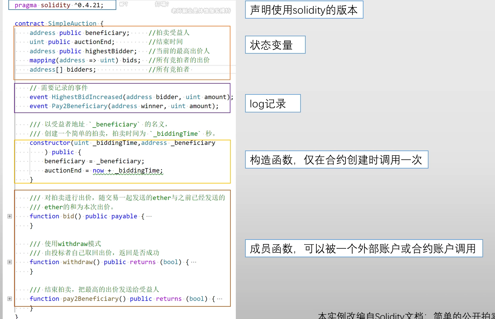

##### solidity 语言的特点：

1. 静态类型语言：Solidity 是静态类型的，意味着每个变量在声明时必须指定类型（如 uint, address 等），这有助于减少运行时错误。

2. 面向对象：Solidity 支持面向对象的编程范式，允许使用类（contract）和继承（inheritance）来构建复杂的合约结构。

3. 基于 Ethereum Virtual Machine (EVM)：Solidity 编写的代码会被编译成 EVM 字节码，运行在以太坊的虚拟机上，因此它可以与以太坊区块链交互。

4. 支持事件和日志：Solidity 允许定义事件，当合约的状态变化时，可以触发事件，方便前端应用监听并更新界面。事件也是合约执行的日志记录。

5. 安全性特性：Solidity 在设计上注重安全性，提供了多种机制，如修饰器（modifier）和访问控制，以确保合约的安全性和防止常见漏洞，如重入攻击等。

6. gas 机制：在以太坊网络上执行操作需要消耗“gas”，Solidity 程序员需要考虑合约执行的成本和优化合约的 gas 消耗。

7. 函数修饰符：Solidity 提供了函数修饰符（如 public, private, internal, external）来控制函数的访问权限，增强了合约的灵活性和安全性。

8. 合约与交易的交互：Solidity 允许合约与其他合约进行交互，可以调用其他合约的函数，也可以发送以太币（ETH）到其他合约。

9. 支持库和接口：Solidity 支持通过库（library）和接口（interface）来重用代码和定义合约之间的交互规范，提高了代码的模块化和可维护性。

10. 复杂的数据结构：Solidity 支持多种数据结构，如 struct、mapping 和数组，这些使得合约可以存储复杂的数据。

##### 外部账户如何调用智能合约

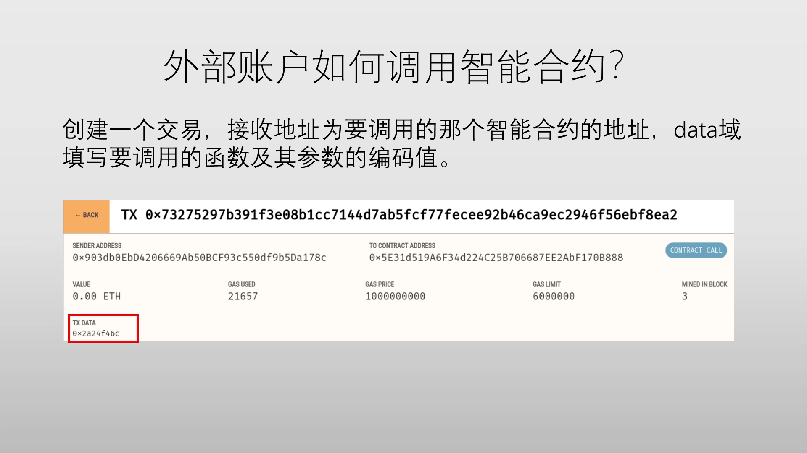

##### 一个合约如何调用另一个合约中的函数

**方式一：**
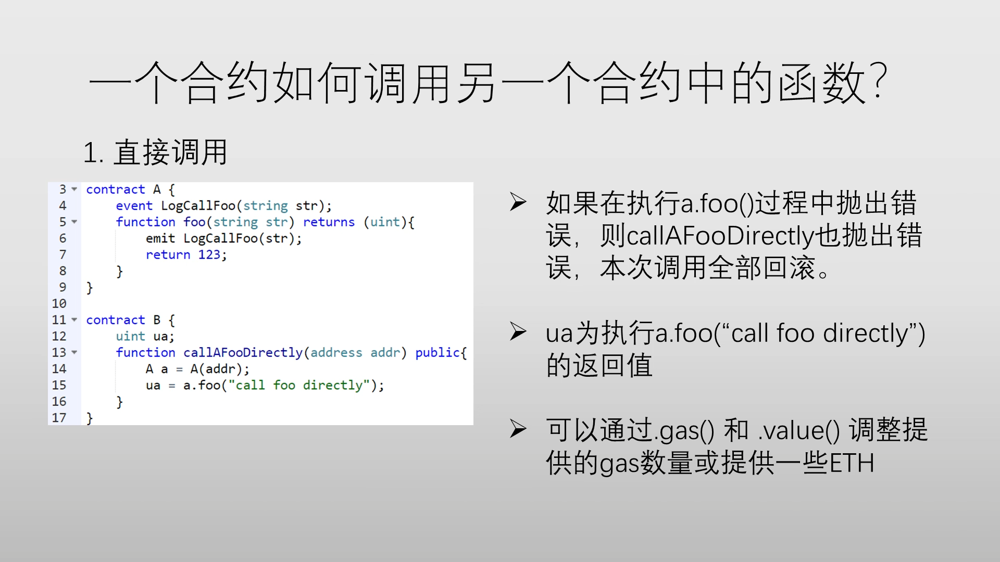

**方式二：**
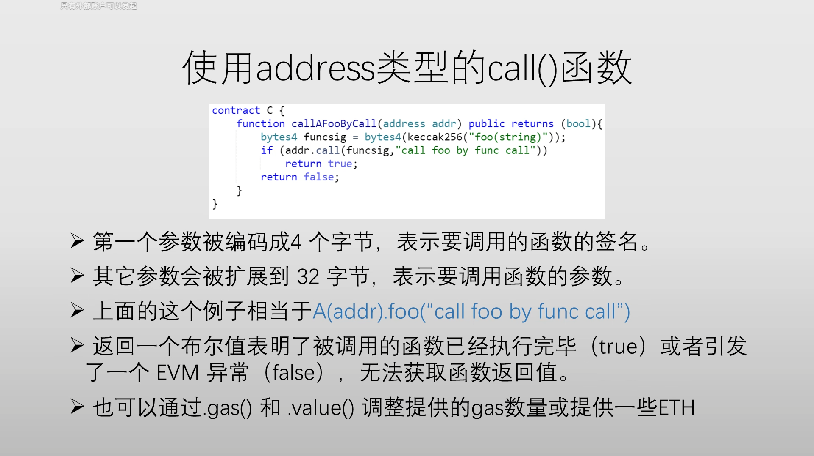

**方式三：**
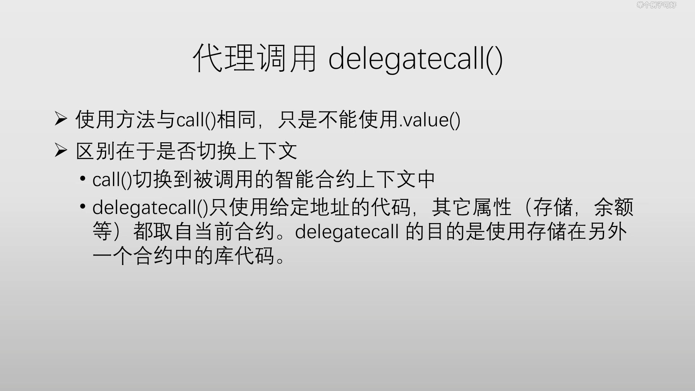

##### 智能合约的 fallback()函数，兜底函数。

在 Solidity 中，fallback 函数是一种特殊的函数，主要用于处理合约接收到以太币（ETH）或调用未定义函数时的情况。它有以下几个主要作用：

1. 接收以太币（ETH）：
   - 当智能合约接收到以太币时，如果没有指定特定的 receive() 函数，或者调用的数据与任何现有函数不匹配，fallback() 函数会被触发。
   - 它可以用来接收来自外部账户或合约的以太币交易。也就是说，fallback 函数可以实现一个合约的“收款”功能。
2. 处理未定义的函数调用：
   - 当外部调用一个合约中没有定义的函数时（即函数名称或参数不匹配任何已声明的函数），fallback() 函数会被触发。
   - 这使得智能合约能够处理那些意外的、错误的或无法识别的调用，而不使交易失败。
3. 防止意外的函数调用：
   - 在某些情况下，fallback() 函数也可以作为一种“保护机制”，避免未经授权的调用。开发者可以在 fallback() 函数中添加代码，用来日志记录或保护合约免受不良行为的影响。
4. 限制合约交互：
   - 如果你希望智能合约只接收以太币而不允许其他函数调用，可以将合约的 fallback() 函数设计为一个简单的“接收”函数，直接拒绝所有调用。

**Fallback 函数的结构：**
Solidity 中的 fallback 函数有两个重要特点：

1. 不能有函数名。
2. 不能有返回值。
3. 只能有 external 可见性。
4. 不能修改状态变量。

**代码示例：**

```solidity
pragma solidity ^0.8.0;

contract MyContract {
    // fallback 函数用于接收ETH
    fallback() external payable {
        // 在这里可以处理接收到的ETH
        emit LogFallback(msg.sender, msg.value);
    }

    // 接收以太币时调用的函数（如果存在）
    receive() external payable {
        // receive 函数只能用于接收ETH
        emit LogReceived(msg.sender, msg.value);
    }

    event LogFallback(address sender, uint amount);
    event LogReceived(address sender, uint amount);
}

```

在上面的例子中：

- receive() 是一个专门的函数，只有在合约接收以太币时才会被触发。
- fallback() 用于处理其他情况，比如未匹配的函数调用或额外的以太币转账。

**重要的注意事项：**

- **Gas 消耗：** fallback() 函数通常不应该做复杂的计算，因为它通常由外部交易触发，如果执行过于复杂，可能会导致交易失败或者高额的 gas 费用。
- **触发条件：** 如果智能合约有 receive() 函数，它会优先被调用来接收以太币；如果没有 receive() 函数，而发生了没有数据的转账，则会触发 fallback() 函数。

**总结：**

- **receive() 函数：** 专门用于接收 ETH，必须声明为 external payable。
- **fallback() 函数：** 用于处理所有未匹配的调用和接收 ETH，也可以包含合约中无法找到的函数调用。
- fallback() 也可以用于日志记录、拒绝调用或保护合约安全等操作。

##### 智能合约的创建和运行

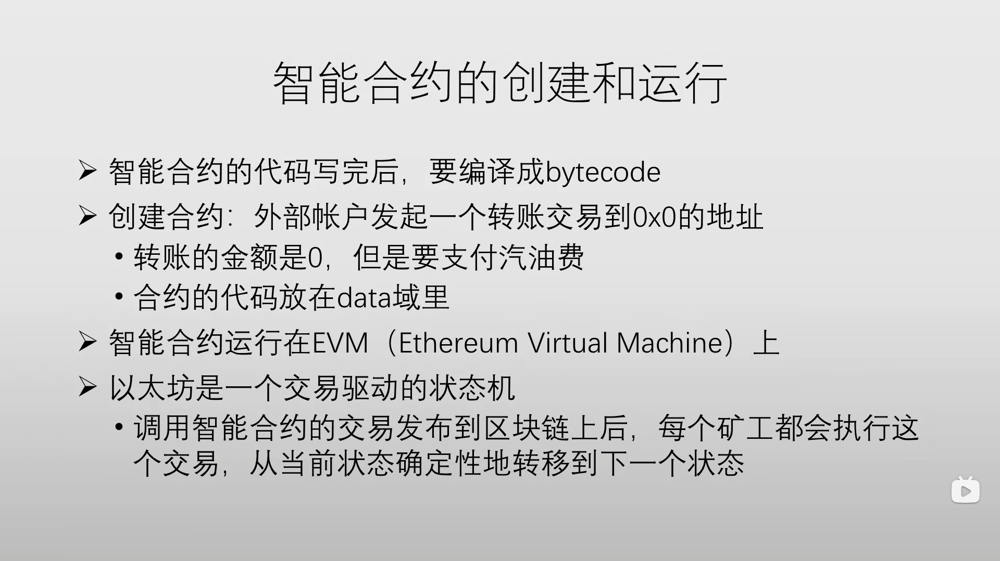

##### 汽油费（gas fee）

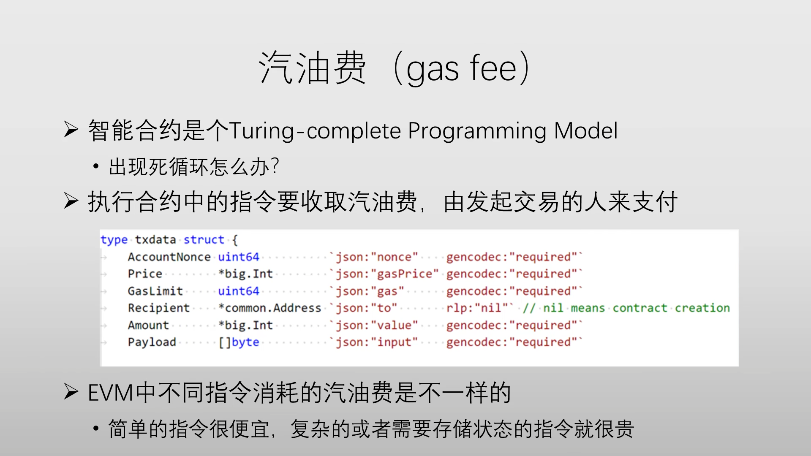

- 汽油费是给那个获得记账权成功发布区块的矿工
- 一个交易如果汽油费不足，会回滚交易，但不退还汽油费（防止恶意攻击）
- ETH 最小单位是 Wei,1ETH=10^18 Wei

##### 智能合约的错误处理

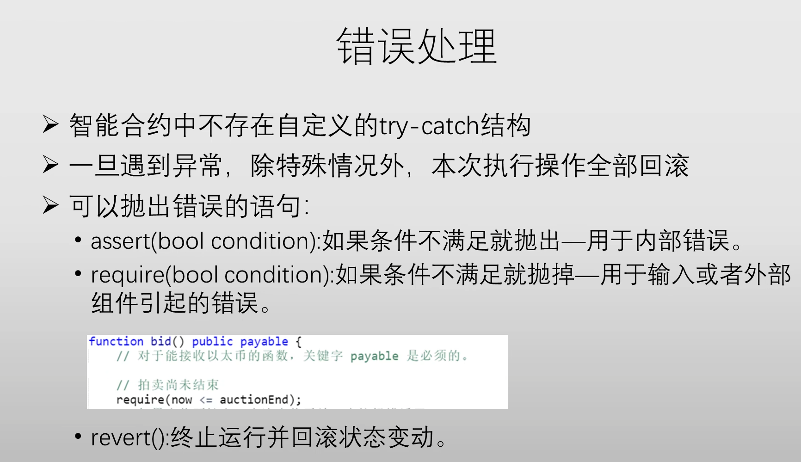

##### 智能合约的嵌套调用

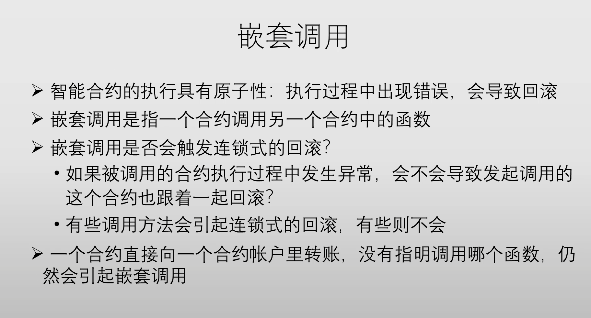

##### ETH 中区块头的 GasLimit 字段

- 这个字段规定了区块中所有交易消耗的汽油费总和的上限。
- 这个 GasLimit 字段矿工可以动态调整，是上一个 GasLimit 值的 1 / 1024 浮动范围。

##### ETH 中是先挖矿（生成新的区块）还是先执行智能合约？

答：先执行智能合约，在挖矿。执行智能合约只是在本地修改区块的状态，只有在打包成区块后才算是正式的区块。此时才能被其他全节点看到。因为区块头中有三个树的哈希值，都是通过执行区块体中所有交易后得到的，区块体中包括智能合约。

##### ETH 中智能合约执行错误，有没有必要发布到区块链上？

答：需要发布到区块链上，这样其他全节点才能知道区块的状态是错误的，才能收取汽油费。

##### 智能合约 中的 Receipt 数据结构

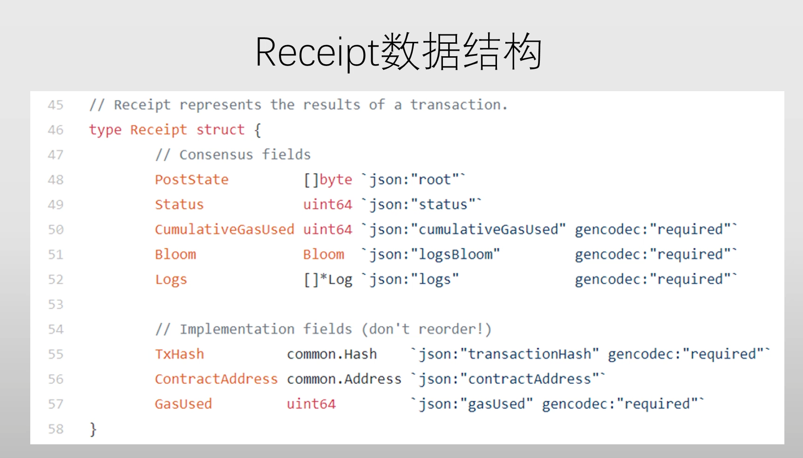

##### 智能合约是否支持多线程？

答：soildity 语言不支持多线程。多线程多个核对内存调用顺序不同的话，有可能导致求 hash 值不同。

##### 智能合约可以获得的区块信息：

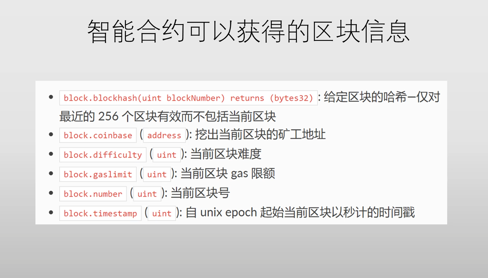

##### 智能合约可以获得的调用信息：

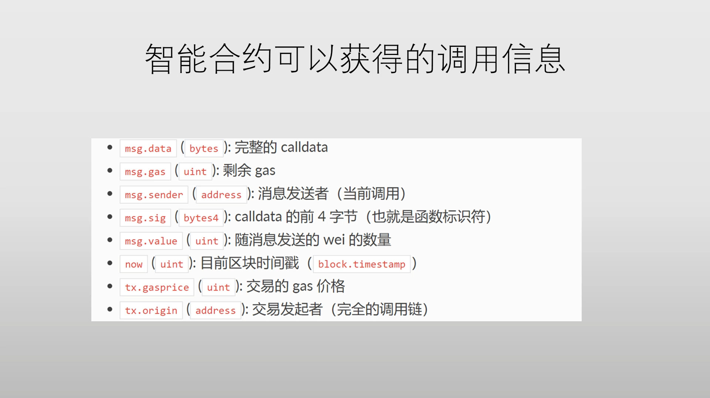

##### 智能合约中的地址类型：

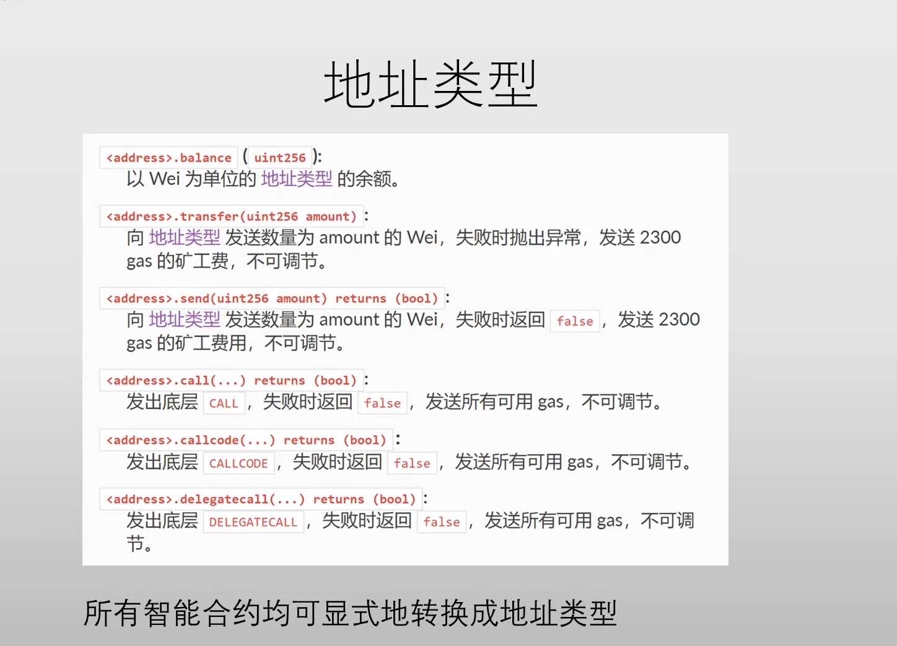

### 23-ETH-TheDAO

##### DAO: (Decentralized Autonomous Organization) 去中心化自治组织

##### DAC: (Decentralized Autonomous Corporation) 去中心化自治公司

##### TheDAO

**The DAO** 是一个基于以太坊区块链的去中心化投资组织，旨在通过智能合约来实现完全的自治和透明。它的目标是通过社区成员的共同决策来管理和投资资金，而不依赖传统的管理结构或中介机构。（The DAO 是一个运行在区块链上的智能合约。）

- The DAO 从 2016 年 5 月开始众筹，差不多一个月时间筹集到了 1.5 亿美元的以太币。然而由于智能合约中的一个漏洞，黑客使用了重入攻击从里面转走了 5000 万美元的以太币。
- 为了不让黑客获利，由于会有个 28 天的冷静期，在这段时间内以太坊团队先是进行了软分叉，以失败告终。最终以太坊团队决定使用硬分叉，需要升级软件，将黑客的钱退回给投资者。但有部分人觉得这与去中心化的理念不符，于是以太坊社区分裂成了两大阵营，以太坊经典（ETC）和以太坊改进版（ETH）。由于两条链算法和规则都一样，这样很容易导致双花攻击。最后给每条链加了一个 ChainID,才得以解决双花攻击问题。

### 24-ETH-反思

##### 1.智能合约真的智能吗？

答：智能合约并不是真正的智能，没有应用到任何人工智能（AI），它只是按照事先写好的代码执行。可以理解成自动执行的合同。

##### 2.智能合约的不可篡改性有什么缺点？

答：智能合约的不可篡改性是一把双刃剑。如果智能合约存在 BUG，是不能修改的。比如 TheDAO 事件,最终硬分叉解决了问题，也是将所有 TheDAO 的账户转到另一个智能合约上，因为这个 BUG 不能修改。假如只针对黑客的账户进行处理，这个智能合约上的 BUG 依然存在，以后可能还有人利用这个 BUG 获利。所以发布智能合约前一定要测试测试再测试。

##### 3.不可篡改性是绝对的吗？

答：不是绝对的。nothing is irrevocable.

##### 4. solidity 语言设计上有没有什么问题？

##### 5. 去中心化意味着什么？

答：针对 The DAO 事件，以太坊团队为了挽回损失，进行了硬分叉。这违背了去中心化的理念吗？有的人觉得，是否进行硬分叉时以太坊进行了投票，绝大多数人同意了，所以不算违背去中心化的理念。但有一部分人认为，你仅仅升级了一下程序，就把别人账上钱转走了，这违背了去中心化的理念。所以 ETC 币应运而生。

##### 6. decentralized !== distributed

去中心化 ！== 分布式。

### 25-ETH-美链（Beauty Chain）

##### 智能合约出问题的又一个案例

##### 背景介绍

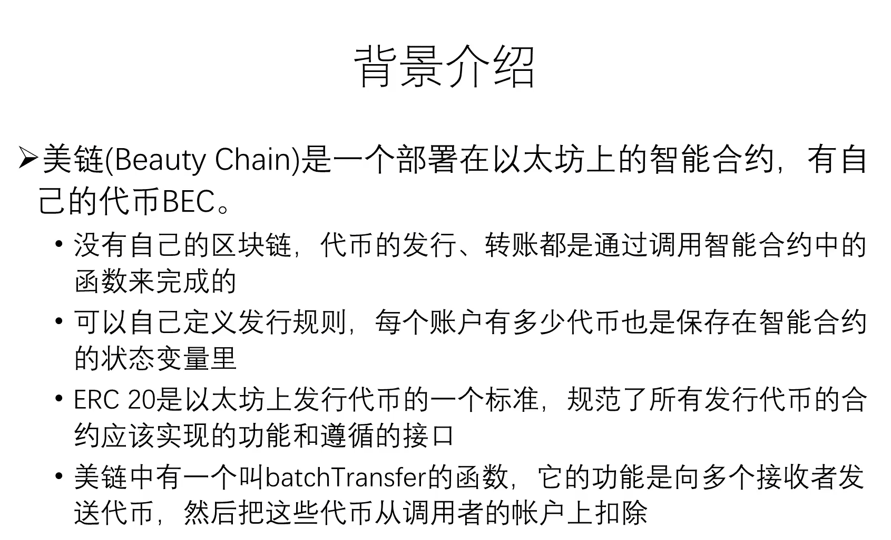

##### 美链智能合约中批量转代币的代码

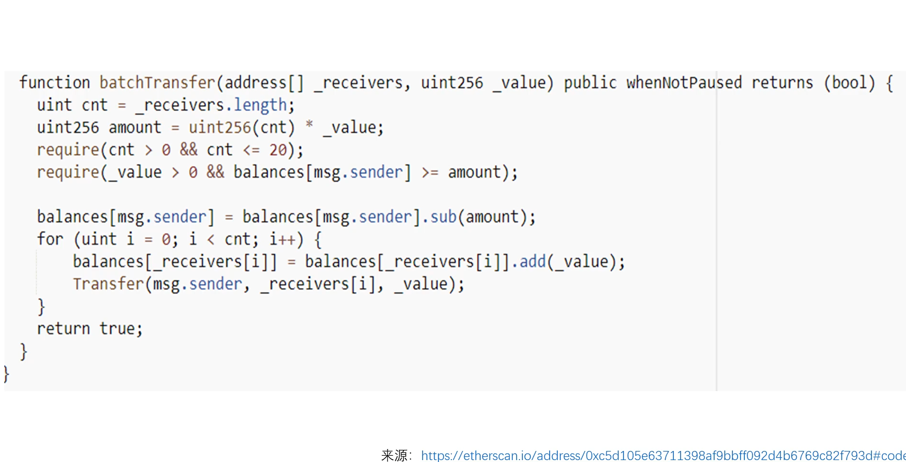

问题出现在这行代码上 unit256 amount = uint256(cnt) \* \_value; 当\_value 的值很大时，amount 计算的值可能会溢出。相当于减的是 amount 值很小，而加的还是\_value 这个大值。

##### 预防措施

soliity 语言提供了 SafeMath 库，可以防止溢出和下溢。

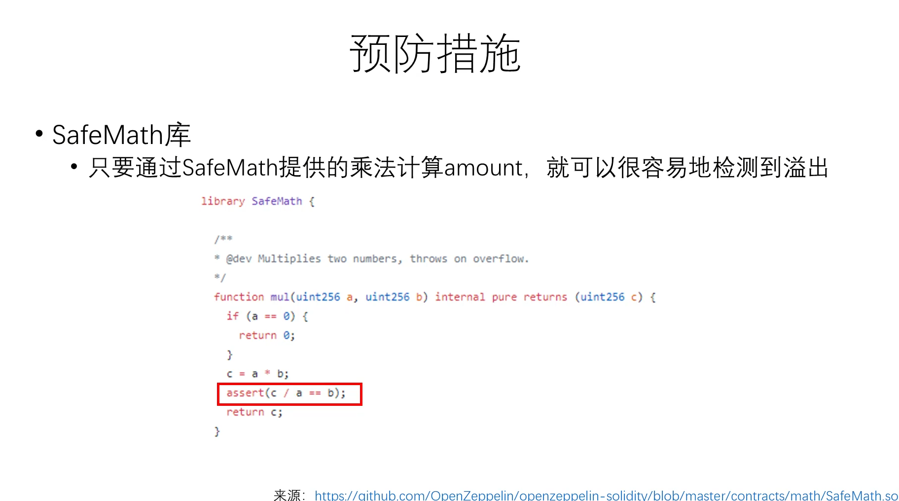

### 26-总结
