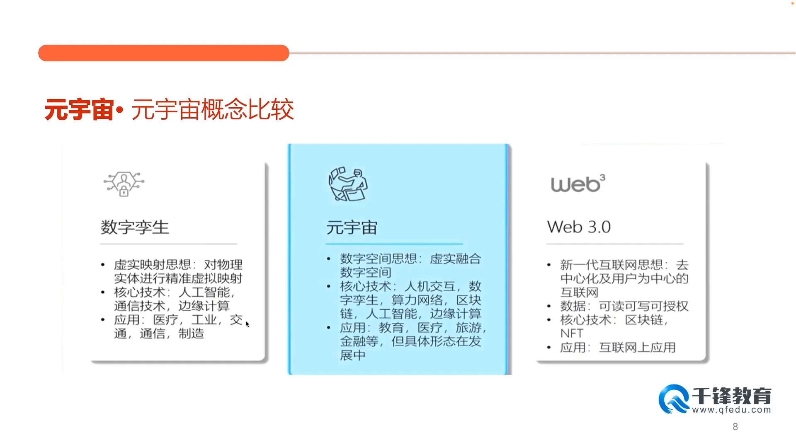
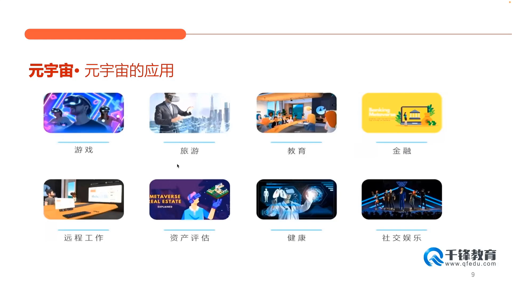
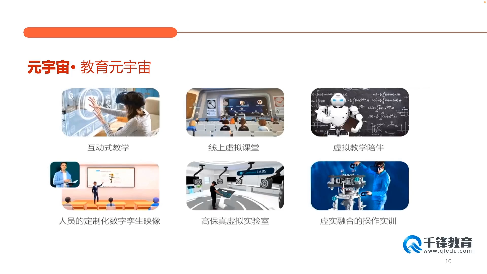
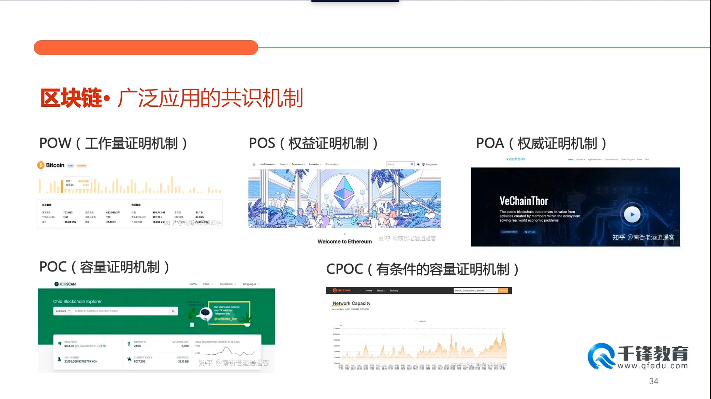
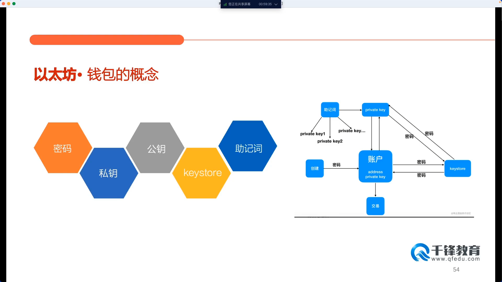

# 千锋教育前端 Web3.0 DeFi 项目实战教程 以太坊 DApp 开发视频教程完整版

_视频发布时间：2023 年 2 月 24 日_

### 005-web3.0 介绍

##### Web3 面试最常见的 10 个问题

**1. 什么是 web3? web2 和 web3 的区别是什么?**
答：Web3 指的是下一代互联网，它基于区块链技术构建的去中心化网络。与传统 Web2.0（如社交媒体、电子商务等）相比
**2. Pow(工作量证明)和 Pos(权益证明)有什么区别?**
答：Pow 机制是比特币采用的一种挖矿奖励机制，比特币挖矿比的就是算力，发展到后期，只能使用专业的 AISC 芯片设备进行挖矿。普通人挖矿的成本非常高，可能忙活了半天没有挖到新的区块，最后白忙活。后来出现了矿池的机制，矿池归矿主所有，下面的矿工在同一个矿池下进行挖矿，当有人挖出矿时。矿主会根据每个矿工提交的 share 进行酬劳分配，而这个 share 就是工作量证明。Pos 权益证明是以太坊中提出来的，前期以太坊也是有挖矿机制的，虽然以太坊的出块时间远远低于比特币，但还是耗能比较大，对环境也不友好。为了解决这个问题，以太坊在 2022 年实现了由 Pow 机制转化成 Pos 机制。使用投票代替挖矿的方式，选出新的区块的发布。这种做法大大减少了能耗，同时也降低了挖矿的成本。

**3. 比特币和以太坊有什么区别？**
**4. 什么是智能合约？**
**5. 公钥和私钥？**
**6. 简要说一下什么是 DApp、DAO、Gamefi、Defi?**
**7. 什么是 Gas?**
**8. 用一句话讲一下 amm 机制？**
答：AMM（自动化做市商）机制通过智能合约自动匹配和定价交易，允许用户在去中心化交易所中无需传统订单簿即可进行资产交换。
**9. 你玩过一些什么应用？**
**10. opensea 和 looksrare 的区别？**
答：OpenSea 和 LooksRare 都是 NFT（非同质化代币）市场平台，但它们有一些关键区别：

1. 平台定位：

- OpenSea 是目前最大的 NFT 市场，支持各种类型的 NFT，包括艺术品、收藏品、游戏道具等，提供广泛的支持和高流动性。
- LooksRare 是一个去中心化的 NFT 市场，旨在通过奖励用户参与来增强社区治理，强调用户奖励和交易激励。

2. 交易费用：

- OpenSea 的交易费通常是 2.5%。
- LooksRare 采用了 2% 的交易费，但它还通过其本地代币 $LOOKS 奖励交易者，用户可以通过质押 LOOKS 代币赚取奖励。

3. 去中心化与治理：

- OpenSea 是一个中心化平台，管理由公司运营。
- LooksRare 强调去中心化治理，用户通过 $LOOKS 代币可以参与平台的决策和治理。

4. 用户激励：

- OpenSea 没有通过代币奖励用户的机制。
- LooksRare 通过交易奖励、质押代币和参与平台治理等方式激励用户。
  总结来说，OpenSea 更侧重于成为广泛使用的 NFT 市场，而 LooksRare 更注重去中心化和通过激励机制吸引用户参与。

### 006-元宇宙概念介绍

##### 元宇宙概念比较

##### 元宇宙的应用

##### 教育元宇宙

### 007-NFT 概念

##### NFT 全称 Non-fungible token,非同质化代币

在 Web3 中，NFT（非同质化代币，Non-Fungible Token，直译：不可替代的代币）是一种基于区块链技术的数字资产，代表着唯一性和不可互换的物品或内容。与传统的加密货币（如比特币、以太坊）不同，NFT 每个都是独一无二的，不可以被直接交换为其他相同的 NFT，因为它们的价值和特征是不同的。传统的法币都属于同质化代币，是可以互换的。
**Web3 中的 NFT 的关键特点：**

1. **唯一性：**
   每个 NFT 都有独特的标识符（如代币 ID），可以代表特定的数字资产、艺术作品、音乐、视频、游戏道具、虚拟土地等。这种唯一性使得每个 NFT 都具有不可替代的价值。

2. **不可分割性：**
   与比特币等加密货币不同，NFT 不可被分割成小单位进行交易。它们作为整体进行买卖，通常不能像货币那样按比例进行划分。

3. **所有权与控制权：**
   通过 NFT，所有者可以拥有数字物品的唯一所有权。这种所有权是通过区块链上的智能合约实现的，确保了所有权的透明性和不可篡改性。例如，购买一个数字艺术作品的 NFT 实际上等于拥有这件作品的数字所有权。

4. **智能合约与区块链：**
   NFT 是建立在区块链上的，这意味着它们的所有权记录和交易历史是公开且永久存在的。智能合约（如以太坊上的 ERC-721 或 ERC-1155 标准）确保了 NFT 的创建、交易和验证过程的自动化和去中心化。

5. **可转让性：**
   NFT 可以在去中心化的市场平台（如 OpenSea、Rarible、LooksRare 等）上进行买卖和交易。买家和卖家可以自由交易 NFT，但交易的条件和交易记录会永久保留在区块链上。

6. **可编程性：**
   NFT 可以与智能合约结合，使得创作者可以设置特定的规则，例如在每次转售时获取一定比例的版税（即版权费）。这为创作者提供了长期的收益机会。

**Web3 中的 NFT 应用场景：**

1. **数字艺术和收藏品：**
   NFT 在数字艺术领域的应用非常广泛，艺术家可以将他们的作品铸造成 NFT，用户购买后不仅获得作品的所有权，还可以在平台上展示和交易。著名的如 Beeple 的数字艺术作品就以 NFT 形式拍卖并创下高价。

2. **游戏资产：**
   在 Web3 游戏中，NFT 被用作游戏道具、角色、装备、虚拟土地等，玩家可以真正拥有这些物品，并在不同的游戏或平台之间进行转移和交易。

3. **虚拟地产：**
   在元宇宙等虚拟世界中，土地和建筑等虚拟资产可以通过 NFT 来表示，用户可以购买、出售、租赁虚拟地产。

4. **品牌和身份认证：**
   一些品牌利用 NFT 来创建限量版商品或数字身份标识，确保消费者拥有某种特定的、唯一的产品或身份，或者在某些场合（如虚拟会议、活动门票等）提供专属权益。

5. **音乐和媒体内容：**
   NFT 为创作者提供了新的方式来发行和销售音乐、视频等数字内容。艺术家可以通过 NFT 向粉丝直接销售作品，同时设置版税机制，确保每次作品转售时都能从中获利。

**总结：**
NFT 是 Web3 中的一个重要组成部分，它通过区块链技术确保了数字资产的唯一性、所有权和可转让性，使得艺术品、游戏道具、虚拟土地等数字内容能够在去中心化的网络中流通和交易。NFT 不仅赋予数字物品独特的价值，也为创作者提供了新的盈利模式和与社区互动的方式。

### 011-区块链-共识机制

##### 区块链共识机制的类型

### 014-以太坊-钱包

##### 以太坊中钱包的概念

##### 以太坊钱包存储了什么？

AI 的回答：

1. **私钥（Private Key）：** 私钥是钱包的核心，用于签署交易并证明你对钱包中以太币（ETH）及其他资产的控制权。私钥必须保密，一旦泄露，可能导致资产被盗。

2. **公钥（Public Key）：** 公钥是由私钥生成的，类似于一个账户号码，可以公开给别人用来接收 ETH 和其他代币。公钥是由私钥加密而成，但不能从公钥反推出私钥。

3. **以太坊地址（Ethereum Address）：** 是由公钥经过哈希计算生成的，用于标识账户。用户可以通过这个地址接收 ETH 或 ERC-20 代币。

4. **交易记录（Transaction History）：** 钱包会保存你发送或接收的所有交易记录。每一笔交易都会包含发送方、接收方、金额等信息，并且所有的交易信息都在区块链上公开可查。

5. **智能合约数据：** 如果钱包与智能合约交互（例如与去中心化应用程序 DApp 连接），它还会存储与智能合约相关的数据和状态。

6. **代币和资产：** 除了以太币，钱包还可能存储其他基于以太坊的代币（如 ERC-20 代币）和资产信息。

这些信息在钱包中是加密存储的，私钥是唯一能解锁和管理这些资产的密钥。

##### 以太坊钱包分为热钱包和冷钱包

- **冷钱包** 是脱离网络连接的离线钱包
- **热钱包** 需要联网才能使用的钱包，比如 MetaMask
